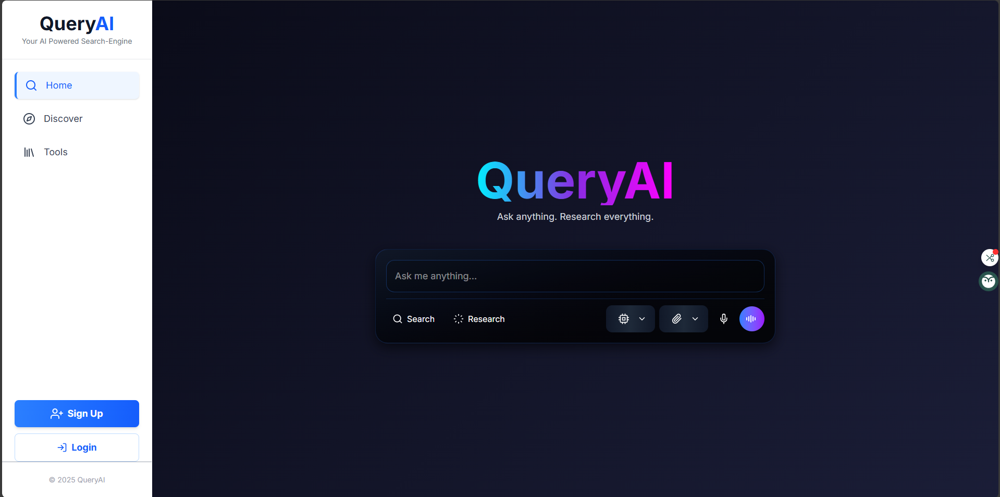

# QueryAI Search Engine

An advanced, AI-powered answer engine that moves beyond traditional search by providing summarized, sourced, and conversational answers from real-time web results. Inspired by Perplexity AI.


---

### ▶️ [Live Demo](https://query-ai-five.vercel.app/)

---

## 📖 About The Project

QueryAI is a full-stack, AI-native search engine designed to provide direct, intelligent answers instead of just a list of links. It fetches real-time information from the web using various APIs, then leverages the Google Gemini LLM to synthesize comprehensive, accurate answers with inline citations. The project features a decoupled architecture with a Next.js frontend and a custom Express.js backend for authentication and data persistence.




---

## 🌟 Key Features

-   **AI-Powered Answers**: Get summarized answers from live web results using SerpApi and Google Gemini.
-   **Full User Authentication**: Secure user registration and login system built from scratch using JWT, bcrypt, and a Node.js backend.
-   **Voice-to-Voice Conversational Chat**: An immersive, hands-free search experience using the Web Speech API for both speech-to-text and text-to-speech.
-   **Personalized User Dashboard**: A dedicated space for logged-in users to view their complete search history.
-   **Multi-Widget "Discover" Page**: A dynamic page with live news (GNews), weather (OpenWeatherMap), and market data (Alpha Vantage) to encourage exploration.
-   **Distinct Search Modes**: Toggle between a standard "Search" and an academic-focused "Research" mode that queries Google Scholar.
-   **Professional Results UI**: A multi-tabbed interface for "Answer", "Images", "Sources", and "Steps", complete with inline citations and a rich display of information.

---

## 🔧 Tech Stack

This project uses a modern, decoupled architecture with a Next.js frontend and an Express.js backend.

| Technology | Role & Justification |
| :--- | :--- |
| **Next.js & React** | The frontend framework, chosen for its powerful features like Server Components, API routes, and optimized performance. |
| **Express.js & Node.js** | The backend server, used to build a robust, custom API for handling user authentication, database operations, and secure API key management. |
| **MongoDB & Mongoose**| A NoSQL database for storing user accounts and search history, chosen for its flexibility and scalability with Node.js. |
| **JWT & bcrypt.js**| Used to implement a secure, stateless authentication system with hashed passwords and signed JSON Web Tokens. |
| **Google Gemini API** | The core Large Language Model used for synthesizing answers, summarizing text, and powering AI tools. |
| **SerpApi** | Provides real-time, structured search results from Google, Google Scholar, and Google Videos. |
| **Web Speech API** | A browser-native API used for both Speech-to-Text (voice input) and Text-to-Speech (voice output), enabling the voice chat feature for free. |
| **Docker & Docker Compose**| Used to containerize both the frontend and backend applications for consistent development and easy deployment. |
| **Tailwind CSS** | A utility-first CSS framework for rapidly building the modern, responsive, and sleek user interface. |

---

## 📦 Getting Started

This project is a monorepo with a separate `frontend` and `backend`. To get a local copy up and running, follow these steps.

### Prerequisites

-   **Node.js** (`v18` or higher)
-   **npm** (`v8` or higher)
-   **Docker** and **Docker Compose** (Recommended for easiest setup)
-   A **MongoDB** instance (local or a free cloud instance from [MongoDB Atlas](https://www.mongodb.com/cloud/atlas))
-   API keys for **SerpApi**, **Google Gemini**, **GNews**, **OpenWeatherMap**, and **Alpha Vantage**.

### Installation & Setup with Docker (Recommended)

1.  **Clone the repository:**
    ```bash
    git clone [https://github.com/vikasgautam2003/query-ai-search-engine.git](https://github.com/vikasgautam2003/query-ai-search-engine.git)
    cd query-ai-search-engine
    ```
2.  **Create backend environment file:**
    Create a `.env` file in the `backend/` folder and add all your secret keys:
    ```env
    MONGO_URI="your_mongodb_connection_string"
    JWT_SECRET="your_super_secret_jwt_key"
    SERPAPI_API_KEY="..."
    GEMINI_API_KEY="..."
    GNEWS_API_KEY="..."
    OPENWEATHER_API_KEY="..."
    ALPHAVANTAGE_API_KEY="..."
    ```
3.  **Create frontend environment file:**
    Create a `.env.local` file in the `frontend/` folder to point to the local backend:
    ```env
    NEXT_PUBLIC_BACKEND_URL="http://localhost:5000"
    ```
4.  **Build and Run with Docker Compose:**
    From the root directory, run:
    ```bash
    docker-compose up --build
    ```

The frontend will be available at `http://localhost:3000` and the backend at `http://localhost:5000`.

---

## 📁 Project Structure

├── backend/            # Express.js Backend
│   ├── models/
│   ├── routes/
│   ├── middleware/
│   ├── .env
│   ├── index.js
│   └── package.json
├── frontend/           # Next.js Frontend
│   ├── src/
│   │   ├── app/
│   │   ├── components/
│   │   ├── context/
│   │   └── hooks/
│   ├── .env.local
│   ├── package.json
│   └── next.config.js
├── docker-compose.yml
└── README.md


---

## 🎯 Future Roadmap

- [ ] **Saved Items/Bookmarks**: Allow users to save specific search results or articles to their dashboard.
- [ ] **Personalization**: Use the selected "Interests" from the Discover page to dynamically customize the news feed.
- [ ] **AI Tools**: Build out the "AI Tools" page with standalone utilities like a text summarizer or code debugger.
- [ ] **Conversational Follow-ups**: Enhance the results page to maintain context and allow for a chat-like follow-up conversation.

---

## 📜 License

Distributed under the MIT License. See `LICENSE` for more information.

---

## 📧 Contact

Vikas Gautam - [LinkedIn](https://www.linkedin.com/in/vikas-gautam-ab5ab8278/)

Project Link: [https://github.com/vikasgautam2003/query-ai-search-engine](https://github.com/vikasgautam2003/query-ai-search-engine)
